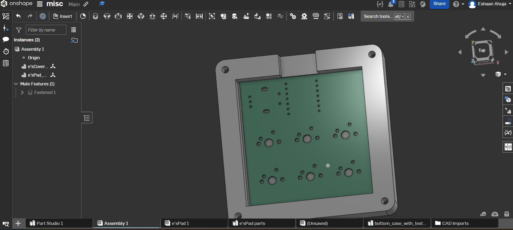
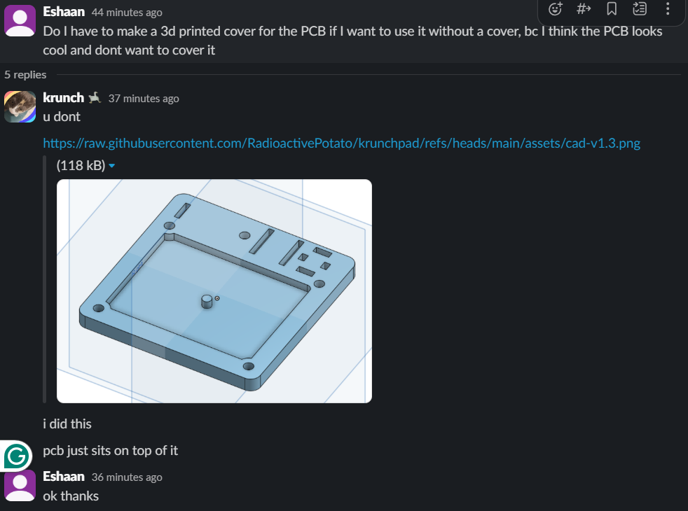

# e'sPad

Screenshot of overall pad

Screenshot of schematic

Screenshot of PCB

Screenshot of Case

Please note: I only want a case that covers the bottom side of the pcb not the top because i think the pcb looks cool and i don't want to cover it, so i only have a bottom case. I asked in the slack and people said that you've let them do it before so it should be ok

Bill of materials:
PCB
Case
6 switches
6 keycaps
1 potentiometer
XIAO

I have my own 3d printer and can print the case myself if that's easier

Sorry if i missed anything
