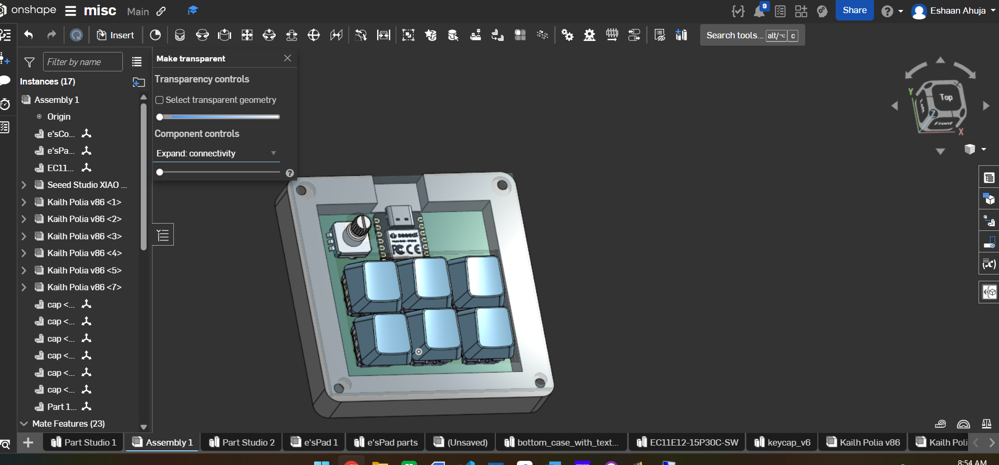
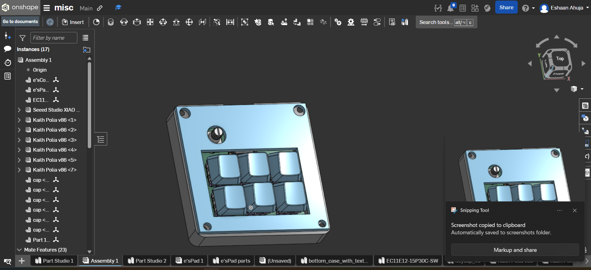
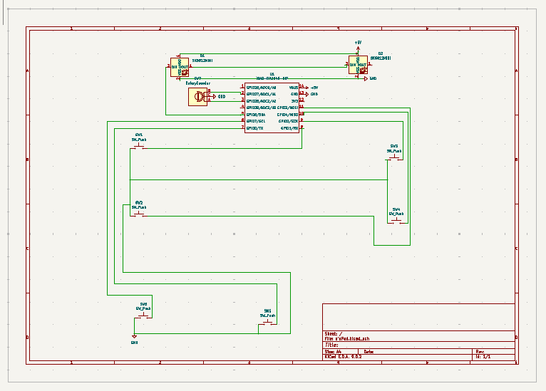
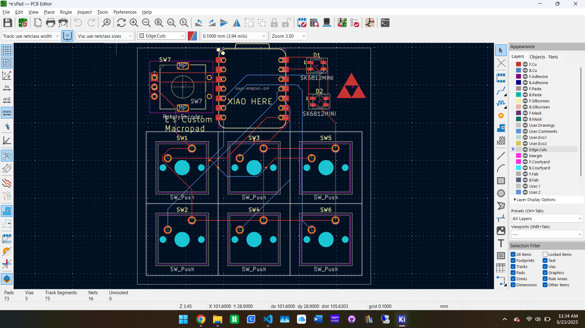
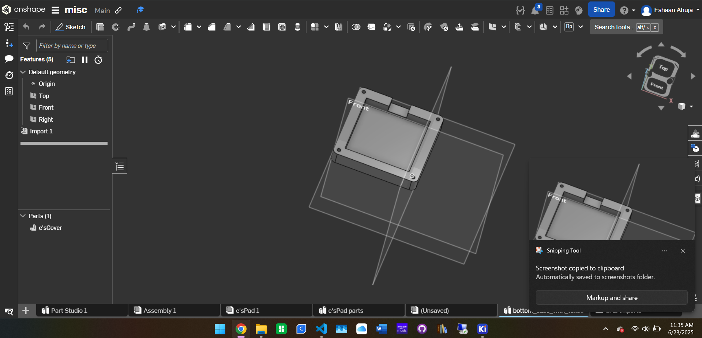
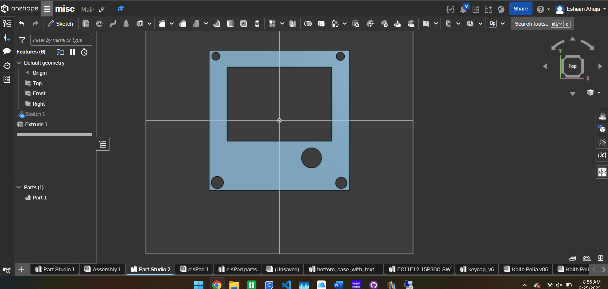

# e'sPad

Screenshot of overall pad with top transparent

Screenshot of pad without transparency of top case

Screenshot of schematic

Screenshot of PCB

Screenshot of bottom Case

Screenshot of top case

|Bill of materials:|Notes|
|-|-|
|PCB||
|top and bottom Case|I have my own 3d printer and can print the case myself if that's easier|
|6 switches||
|6 keycaps|I have my own 3d printer and can print the keycaps myself if that's easier|
|1 potentiometer/knob|I have my own potentiometer and can use that if you dont want to send me one|
|XIAO rp2040 seed studio||
Note: I have my own soldering iron as well btw so i can use that

Sorry if i missed anything
